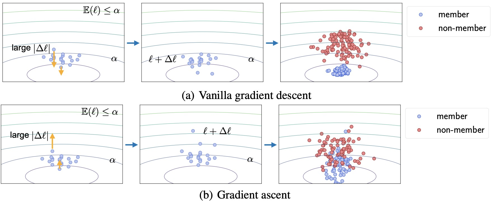

# RelaxLoss
[](LICENSE)
[](https://www.python.org/)
[](https://pytorch.org/)


This repository contains the implementation for ["RelaxLoss: Defending Membership Inference Attacks without Losing Utility" (ICLR 2022)](https://openreview.net/pdf?id=FEDfGWVZYIn).

Contact: Dingfan Chen ([dingfan.chen@cispa.de](mailto:dingfan.chen@cispa.de))


## Requirements
This implementation is based on [PyTorch](https://www.anaconda.com/download/) (tested for version 1.7.0). Please refer to [requirements.txt](requirements.txt) for the other required packages and version.  

## Datasets
The implementation supports the following datasets:
- CIFAR10, CIFAR100 (corresponding files are in folder `"source/cifar"`)
- [Texas](https://www.dshs.texas.gov/THCIC/Hospitals/Download.shtm), [Purchase](https://www.kaggle.com/c/acquire-valued-shoppers-challenge) (corresponding files are in folder `"source/nonimage"`)

The datasets will be automatically downloaded to folder `"data"` once you run the program. 
 
## Running Experiments
### API (Run experiments using the default configurations).
```main
cd source
python main.py \
--dataset "Dataset name" \
--method "Defense method" \
--mode "Experiment mode" \
[--model "Model architecture"(used only for CIFAR datasets)] \ 
```
- Set the `"Defense methods"` to be `'relaxloss'` to run our method.  
- The following defense methods are supported: 
`'vanilla', 'relaxloss', 'advreg', 'dpsgd', 'confidence_penalty', 'distillation', 'dropout', 'early_stopping', 'label_smoothing'`.
And `'vanilla'` corresponds to no defense baseline.
- The following `"Experiment modes"` are supported: 
  - `'defense'`: run the defense method to train a target model.
  - `'attack'`:  evaluate the target model under different MIAs (it requires to run defense first).
  - `'shadow'`: run the defense method to train a shadow model.
  - `'defense_attack'`: run the defense method to train a target model and directly evaluate the trained target model under different MIAs.

### Run defense with specific configurations.
- Go into folder `source/cifar/defense` or `source/nonimage/defense` depends on the dataset.
- You can run each defense with command `python 'Defense_name'.py` and specify the arguments in command-lines. Please refer to the `parse_arguments()` function in each python file for more details.
 
### Run attacks.
- Go into folder `source/cifar` or `source/nonimage` depends on the dataset.
- Run attacks by providing the directory that contains the `'model.pt'` file. 
    ``` 
    python run_attacks.py -target "Target_MODELDIR" -shadow "Shadow_MODELDIR"  
    ```
- In the current implementation, the attack `ACC`(accuracy) and `AUC`(area under the ROC curve) are evaluated.
- The following attacks are supported. Please refer to `'source\utils\attack.py` for more details.
    - `'NN','Confidence','Loss','Entropy','Modified-Entorpy` (Black-box)
    - `'grad_wrt_x_l1', 'grad_wrt_x_l2', 'grad_wrt_w_l1', 'grad_wrt_w_l2'` (White-box)

## Citation
```bibtex
@inproceedings{chen2022relaxloss,
  title={RelaxLoss: Defending Membership Inference Attacks without Losing Utility},
  author={Chen, Dingfan and Yu, Ning and Fritz, Mario},
  booktitle={International Conference on Learning Representations (ICLR)},
  year={2022}
}
```

## Acknowledgements
Our implementation uses the source code from the following repositories:
- [Black-box metric-based MIAs](https://github.com/inspire-group/membership-inference-evaluation)
- [Adversarial Regularization](https://github.com/SPIN-UMass/ML-Privacy-Regulization)
- [NN-based Attack](https://github.com/jjy1994/MemGuard)
- [White-box MIAs](https://github.com/shrezaei/MI-Attack)